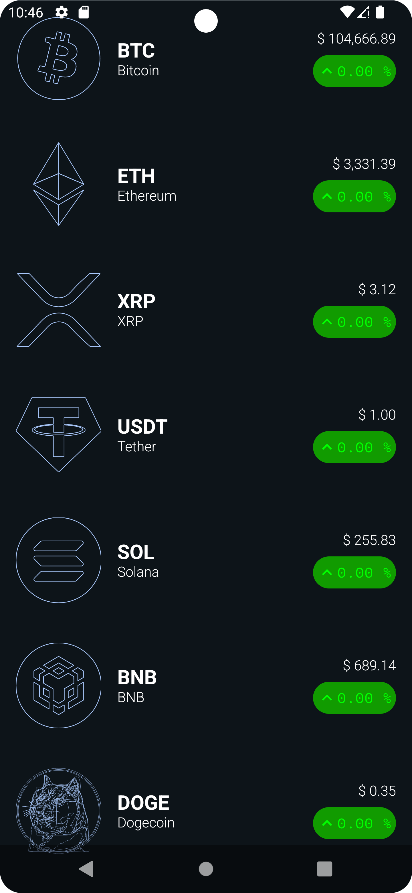

# CryptoTracker

CryptoTracker é um aplicativo para acompanhar preços e informações sobre criptomoedas em tempo real, desenvolvido com foco em desempenho e usabilidade.

## Funcionalidades

- Visualização de preços em tempo real de diversas criptomoedas.
- Gráficos interativos para análise de tendências.
- Filtragem e busca avançada por moedas específicas.
- Suporte para múltiplos idiomas.

## Tecnologias Utilizadas

- **Linguagem:** Kotlin
- **Framework de UI:** Jetpack Compose
- **Gerenciamento de Estado:** StateFlow
- **API de Dados:** [CoinCap API](https://[https://docs.coincap.io/)
- **Análise de Logs:** Firebase Crashlytics

## Pré-requisitos

Antes de começar, certifique-se de ter os seguintes itens instalados:

- [Android Studio](https://developer.android.com/studio)
- JDK 11 ou superior

## Como Executar o Projeto

1. Clone este repositório:

   ```bash
   git clone https://github.com/DanilloSantosTi/CryptoTracker.git
   ```

2. Abra o projeto no Android Studio.

3. Sincronize as dependências do Gradle.

4. Conecte um dispositivo ou inicie um emulador Android.

5. Compile e execute o aplicativo.

## Demonstração

### GIF do Funcionamento

Adicione aqui um GIF demonstrando o funcionamento do aplicativo:


### Capturas de Tela

Adicione aqui algumas capturas de tela do aplicativo:

| Tela Inicial | Detalhes da Moeda |
|--------------|-------------------|
|  |  |

## Contribuição

Contribuições são bem-vindas! Siga os passos abaixo:

1. Faça um fork do repositório.
2. Crie um branch para sua feature ou correção:
   ```bash
   git checkout -b minha-feature
   ```
3. Faça commit das suas alterações:
   ```bash
   git commit -m "Minha nova feature"
   ```
4. Envie para o branch principal:
   ```bash
   git push origin minha-feature
   ```
5. Abra um Pull Request.

## Licença

Este projeto está licenciado sob a Licença MIT. Veja o arquivo [LICENSE](LICENSE) para mais detalhes.

---

**Desenvolvido por [Danillo Santos](https://github.com/DanilloSantosTi).**
